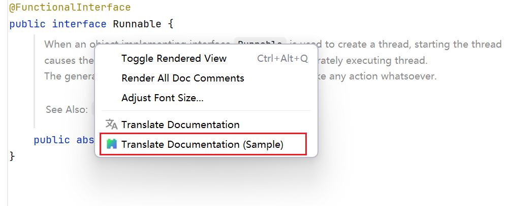
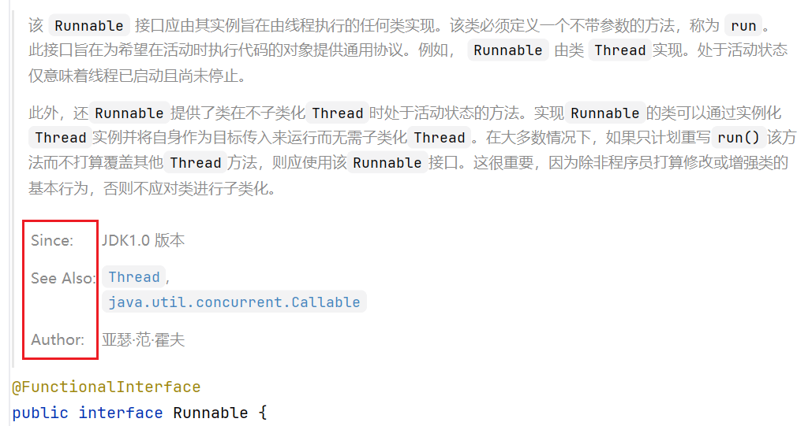

# Intellij Translation 子插件示例

[English Instructions](/README.md)

本项目是基于 [**Intellij Translation Plugin**](https://github.com/YiiGuxing/TranslationPlugin) 的一个子插件示例。  
**Intellij Translation Plugin** 是一个基于 IntelliJ IDE 平台的翻译插件，能够在 IDE 中提供多语言翻译功能。

作为子插件，本示例展示了如何扩展主插件提供的翻译能力。  
开发者可以参考本项目，编写自己的子插件，集成并拓展主插件的翻译服务，以满足定制化需求。

## 特性

- 依赖并扩展 **Intellij Translation Plugin** 的翻译能力；
- 可作为开发自定义翻译相关功能的参考示例。

#### 示例功能

1. 文档翻译：
  

2. 文档翻译时忽略特定元素：
  

## 说明

1. **Intellij Translation Plugin** 的开放 API 目前仍在完善中，子插件可扩展的功能有限。
2. 本项目仅作为子插件开发的示例，实际应用中可能需要根据具体需求进行调整。
3. 本项目不是模板项目，不建议直接基于此项目进行二次开发，建议以官方插件模板项目 [intellij-platform-plugin-template](https://github.com/JetBrains/intellij-platform-plugin-template)
为基础，以本项目作为参考进行开发。

## 开放 API

**Intellij Translation Plugin** 的开放 API 位于 `cn.yiiguxing.plugin.translate.openapi` 包下，目前可用的服务与扩展点如下。

### 服务列表

- `DocumentationTranslationService`：提供文档翻译服务

### 扩展点列表

| 扩展点                                                         | 实现                                                                               |
|-------------------------------------------------------------|----------------------------------------------------------------------------------|
| `cn.yiiguxing.plugin.translate.documentation.elementFilter` | `cn.yiiguxing.plugin.translate.openapi.documentation.DocumentationElementFilter` |

### 源代码

**Intellij Translation Plugin** 开放 API 的源代码已经捆绑在插件 ZIP 发行包中，当你导航到相关的类时，如果 IDE 提示找不到源代码，可以通过手动添加源代码：点击编辑器 banner 通知中的 `Choose Sources...` 链接，选择插件 ZIP 发行包中捆绑的源代码 jar 包（`src/*-src.jar`）即可。注意，此时 IDE 已经自动导航到插件 ZIP 发行包内。
